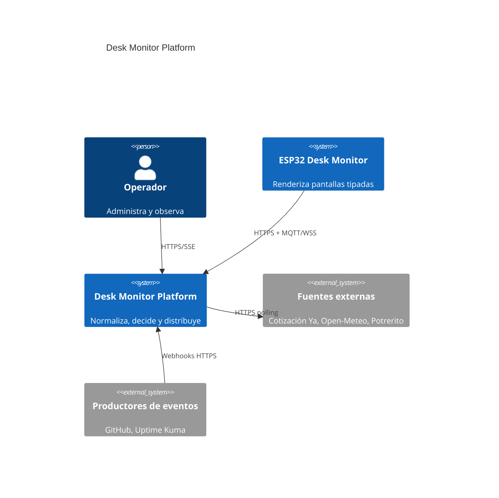
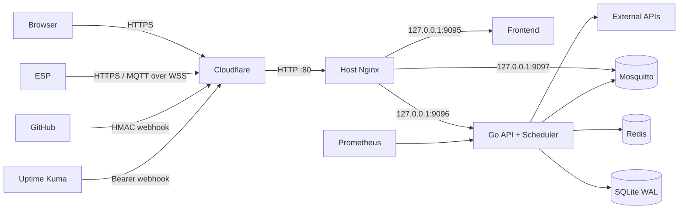
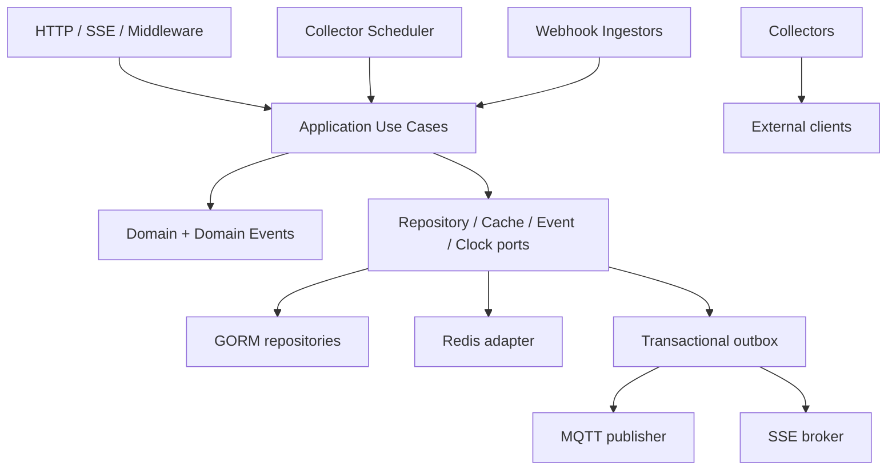

# Arquitectura

## Contexto y límites

Desk Monitor Platform atiende una organización por instalación y múltiples
productos, servicios, perfiles y dispositivos. Los productos iniciales son
`potrerito`, `freshcode` y `facturas`; son datos configurables, no conceptos del
firmware.

## Contenedores de runtime

Nginx es el borde HTTP del host y los tres puertos de aplicación están enlazados
exclusivamente a loopback. Cloudflare termina HTTPS/WSS. El listener MQTT TCP solo
es visible en la red de Compose. El backend es un único proceso en v1 para evitar
escritores SQLite distribuidos.

## Componentes del backend

Las dependencias siempre apuntan hacia `domain` y `application`. Los handlers
traducen DTOs; nunca contienen reglas de negocio. Los repositorios devuelven
entidades de dominio y encapsulan GORM. La composición de dependencias es manual
en un composition root.

## Flujos principales

### Snapshot del dispositivo

1. El dispositivo canjea `device_id + secret` por un JWT corto.
2. Solicita dashboard/config usando `If-None-Match` cuando posee una revisión.
3. El caso de uso obtiene perfil, overrides, estado canónico y alertas activas.
4. Los screen providers generan una lista determinística y limitada.
5. El dispositivo valida `schema_version`, almacena el snapshot y rota localmente.

### Alerta durable

1. Un colector, webhook o acción administrativa cambia estado dentro de una
   transacción.
2. La misma transacción crea/actualiza la alerta y escribe un `outbox_event`.
3. El dispatcher publica QoS 1 y registra el intento.
4. MQTT puede duplicar; `event_id` hace idempotente al dispositivo.
5. Si MQTT estuvo caído, el outbox reintenta; REST sigue mostrando la alerta activa.

### Centro web

React Query obtiene recursos REST. SSE solo anuncia eventos e invalidaciones; el
frontend vuelve a consultar la fuente autoritativa. Redis Pub/Sub permite que el
diseño pueda crecer a varias réplicas, pero una caída de Redis no invalida la DB.

## Reglas de disponibilidad

- SQLite, configuración inválida o claves JWT ausentes impiden readiness.
- Redis caído produce estado `degraded`; lecturas DB y un proceso único continúan.
- MQTT caído produce estado `degraded`; el outbox retiene los eventos.
- Una fuente externa caída afecta únicamente su colector y puede abrir su circuit
  breaker.
- Todas las llamadas externas tienen timeout, límite de bytes, retry con jitter y
  métricas por resultado.
