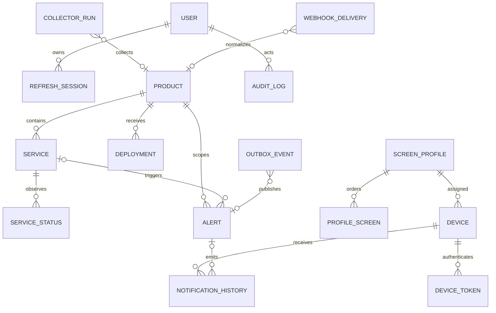

# Modelo de datos

Todos los IDs son ULID en texto y todos los instantes se almacenan en UTC. Las
tablas usan nombres `snake_case`, constraints explícitas y borrado lógico solo
donde la recuperación aporta valor. Payloads arbitrarios se limitan a configuración
de perfil, observaciones normalizadas y entregas auditables.

## Agregados y restricciones

| Entidad | Datos principales | Invariantes |
|---|---|---|
| Product | stable key, nombre, descripción, enabled | key único e inmutable |
| Service | product, key, nombre, kind, endpoint opcional | key único por producto |
| ServiceStatus | service, status, latency, reason, observed_at | append-only |
| Alert | producto/servicio, fingerprint, prioridad, estado, mensaje | una alerta abierta por fingerprint |
| Deployment | repo, branch, workflow, status, commit, autor, timestamps | provider+external_id únicos |
| Device | stable device_id, nombre, perfil, estado, configuración | device_id único e inmutable |
| DeviceToken | device, secret hash, generation, estado, expiración | secreto nunca recuperable |
| ScreenProfile | key, nombre, revision | revision aumenta en cada cambio |
| ProfileScreen | perfil, posición, tipo, enabled, configuración | posición única por perfil |
| MarketQuote | provider, symbol, quote asset, bid/ask/last/change, observed_at | provider+symbol+observed_at únicos |
| WeatherObservation | location key, condición y medidas, observed_at | location+observed_at únicos |
| NotificationHistory | destinatario, canal, prioridad, estado, event_id | event_id+destino+canal únicos |
| Configuration | namespace, key, value tipado, revision | namespace+key únicos |
| OutboxEvent | event_id, topic, payload, attempts, next_attempt, published_at | event_id único |

Estados de servicio: `operational`, `degraded`, `outage`, `maintenance`, `unknown`.
Estados de alerta: `open`, `acknowledged`, `resolved`. Prioridades compartidas:
`critical`, `warning`, `info`, `success`. Deployments: `queued`, `in_progress`,
`success`, `failure`, `cancelled`.

## Portabilidad

- No se usan IDs autoincrementales, enums específicos del motor ni JSON queries en
  reglas de negocio.
- Los booleanos, timestamps y constraints tienen migraciones equivalentes para
  SQLite y PostgreSQL.
- El histórico es append-only; las vistas de estado actual se resuelven mediante
  índices compuestos y repositorios.
- GORM mapea datos, pero nunca crea ni altera el esquema en producción.

